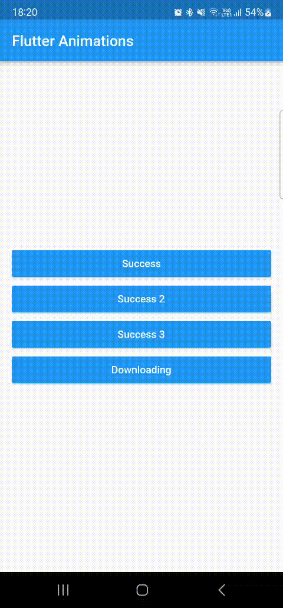
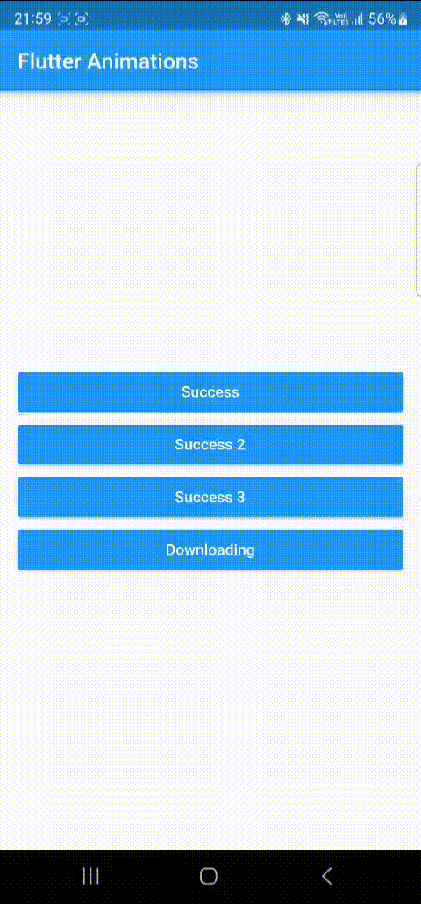

# FLUTTER ANIMATIONS

<p align="center">
  <a href="https://flutter.dev/" target="blank"></a>
</p>
<br>
<table align="center">
<tr>
    <td>
      
    </td>
   <td>
      
    </td>
   <td>
      
    </td>   
  </tr>
  <tr>
    <td>
      
    </td>
   </tr>
</table>

# Ejecutar en desarrollo

1. Clonar el repositorio
2. Ejecutar
```
flutter pub get
```


